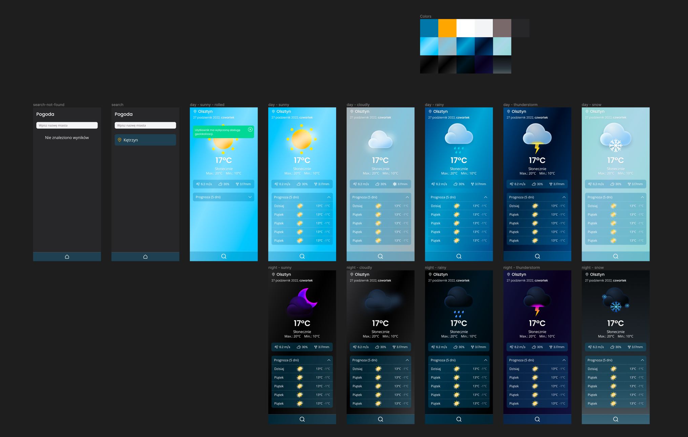

## General info
My first assumption was to write an apk in vanilla js and design the layout in figma.
All components are written from scratch, I don't use any frameworks like bootstrap etc.
It was a fun adventure :smiley:.

## Technologies
* JavaScript
* SCSS
* NPM

## Setup
1. Clone the repo
    ```
    git clone https://github.com/bartoszgebka/weather-app.git
   ```
2. Register account on https://openweathermap.org/ and generate your API key
3. Install NPM packages
    ```
   npm install
   ```
4. Rename file `.env.example` to `.env`.
5. Enter your API KEY in `.env` file
    ```
    API_SECRET = "YOUR API"
   ```
   
## Demo
https://my-weather-bg.netlify.app/

## Figma project
